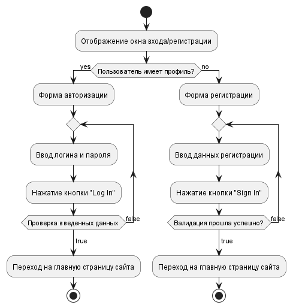
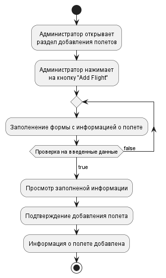
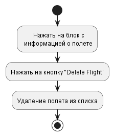
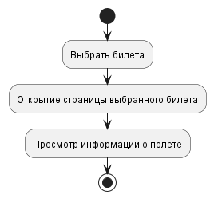
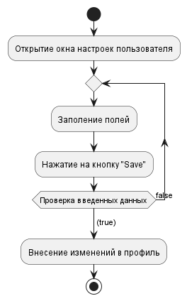

# Содержание
1. [Авторизация в приложении](#1)
2. [Добавление товара](#2)
3. [Удаление товара](#3)
4. [Просмотр товара](#4)
5. [Настройка профиля](#5)

### 1. Авторизация в приложении
При открытии формы входа/регистрации приложение отображает окно для ввода данных. После ввода данных, они проверяются на корректность. Если данные ведены правильно, то приложение предоставляет доступ к профилю пользователя.

### 2. Добавление полета
При нажатии на кнопку "Add Flight" приложение добавит заполненный шаблон в список полетов.

  
### 3. Удаление полета
При нажатии на кнопку "Delete Flight" приложение удалит выбранный полет из списка полетов.

### 4. Просмотр билета
При нажатии на билет появится полная информация о перелете.

### 5. Настройка профиля
После открытия настроек пользователя есть возможность изменить профиль.

