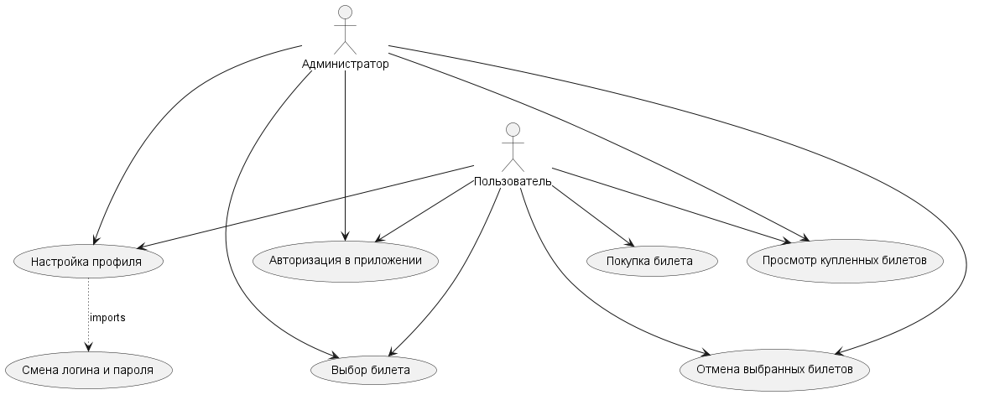

# Поток событий
---

# Диаграмма вариантов использования

# Содержание
1 [Актёры](#1)  
2 [Варианты использования](#2)  
2.1 [Авторизация в приложении](#2.1)  
2.2 [Добавление товара в корзину](#2.2)  
2.3 [Просмотр товаров](#2.3)  
2.4 [Настройка профиля](#2.4)  
2.5 [Сделать заказ](#2.5)  
2.6 [Добавление товара](#2.6)  
2.7 [Удаление товара](#2.7)  
2.8 [Смена логина и пароля](#2.8)  
2.9 [Выбрать размер](#2.9)  
2.10 [Выбрать цвет](#2.10)  
2.11 [Добавить в избранное](#2.11)  
<a name="1"/>

# 1 Актёры

| Актёр | Описание                                                                           |
|:--|:-----------------------------------------------------------------------------------|
| Пользователь приложения | Человек, имеющий(желающий создать) аккаунт на сайте "SkyQuest"                     |
| Администратор приложения | Человек, имеющий аккаунт на сайте "SkyQuest" и занимающийся его администрированием |

<a name="2"/>

# 2 Варианты использования

<a name="2.1"/>

## 2.1 Авторизация в приложении

**Описание.** Вариант использования "Авторизация в приложении" позволяет пользователю войти(создать) в свой аккаунт сайта "SkyQuest".  

**Основной поток.**
1. Вариант использования начинается, когда пользователь нажимает на кнопку "Профиль";
2. Приложение выводит экран, на котором расположена кнопка две формы: для регистрации и для авторизации;
3. Если пользователь уже имеет профиль на сайте, то он выбирает форму для авторизации;
4. Приложение предлагает пользователю ввести логин и пароль;
5. Пользователь нажимает кнопку "Log In";
6. Приложение проверяет правильность введенных данных. Если данные введены неправильно, приложение просит ввести данные повторно;
7. Приложение открывает главную страницу сайта;
8. Если пользователь не имеет аккаунта на сайте, то приложение предлагает пользователю зарегистрироваться, т.е. ввести логин, пароль и повторно ввести пароль для подтверждения;
9. Пользователь нажимает на кнопку "Sign In";
10. Приложение проверяет правильность данных регистрации. Если данные не прошли валидацию, приложение просит ввести данные повторно;
11. Вариант использования завершается.

<a name="2.2"/>

## 2.2 Покупка билета

**Описание.** Вариант использования "Покупка билета" позволяет пользователю приобрести билет на сайте.  

**Основной поток.**
1. Пользователь выбирает билет;
2. Нажимает кнопку "Купить";
3. Заполняет информацию для оплаты;
4. Нажимает "Подтвердить";
5. Приложение оповещает об успешности/неуспешности покупки;
6. Вариант использования завершается.

<a name="2.3"/>

## 2.3 Просмотр оплаченных билетов

**Описание.** Вариант использования "Просмотр оплаченных билетов" позволяет просмотреть ранее купленные билеты.  

**Основной поток.**
1. Пользователь переходит в профиль;
2. Пользователь выбирает билет, нажимая на его форму;
3. Приложение открывает подробную информацию о перелете
4. Вариант использования завершается;

<a name="2.4"/>

## 2.4 Настройка профиля

**Описание.** Вариант использования "Настройка профиля" позволяет отредактировать профиль пользователя.  

**Предусловие.** Пользователь выбрал раздел "Настройка" в главном окне.

**Основной поток.**
1. Пользователь заполняет все интересующие поля. Если не все поля заполнены, изменения не сохранятся;
2. Пользователь нажимает кнопку "Save";
3. Приложение вносит изменения;
4. Вариант использования завершается.

<a name="2.5"/>

## 2.5 Добавление перелета

**Описание.** Вариант использования "Добавление перелета" позволяет пользователю добавить перелет в соотвествующий список.

**Предусловие.** Вариант использования "Добавление товара" доступно только пользователям с ролью администратора.

**Основной поток.**
1. Администратор нажимает на кнопку "Добавить перелет";
2. Администратор вводит информацию о перелете;
3. Администратор нажимает на кнопку "Подтвердить";
4. Вариант использования завершается;

<a name="2.6"/>

## 2.6 Удаление товара

**Описание.** Вариант использования "Удаление перелета" позволяет пользователю удалить выбранный перелет.

**Предусловие.** Вариант использования "Удаление перелета" доступно только пользователям с ролью администратора.

**Основной поток.**
1. Администратор выбирает перелет;
2. Администратор нажимает кнопку "Delete flight";
3. Приложение удаляет перелет из списка;
4. Вариант использования завершается;

<a name="2.7"/>

## 2.7 Смена имени и пароля

**Описание.** Вариант использования "Смена логина и пароля" позволяет изменить логин и пароль от аккаунта.

**Предусловие.** Пользователь должен выполнить вход в свой аккаунт.

**Основной поток.**
1. Пользователь заполняет поля логина и пароля;
2. Пользователь нажимает кнопку "Сохранить";
3. Приложение вносит изменения;
4. Вариант использования завершается.