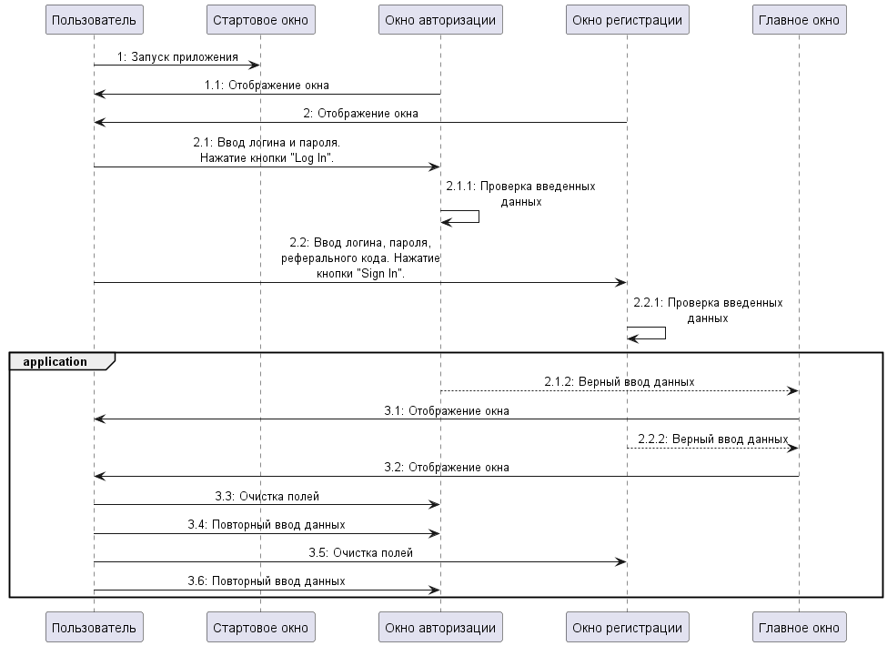
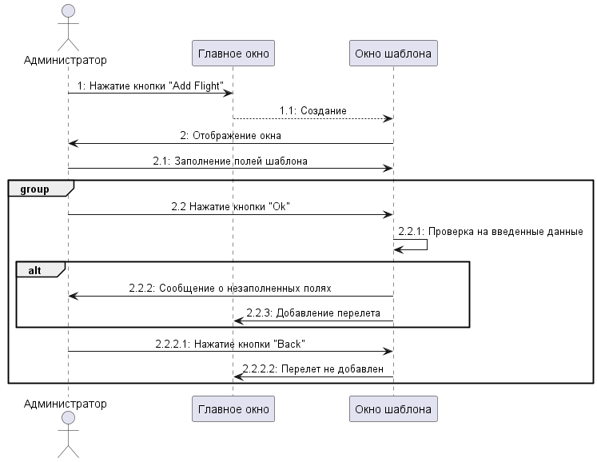
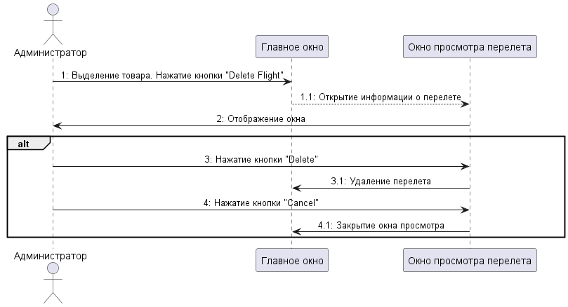
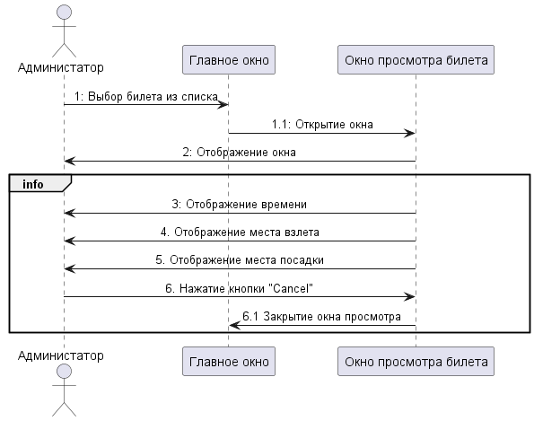
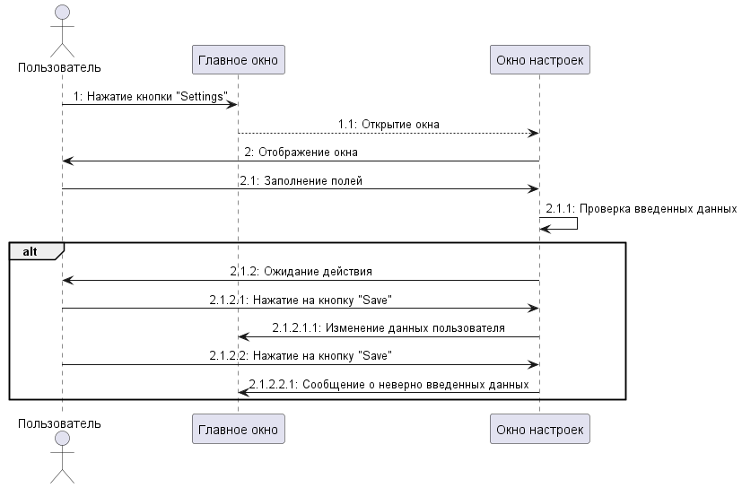

# Диаграммы последовательности
---

# Содержание
1. [Авторизация в приложении](#1)
2. [Добавление перелета](#2)
3. [Удаление перелета](#3)
4. [Просмотр билета](#4)
5. [Настройка профиля](#5)

### 1. Авторизация в приложении

### 2. Добавление перелета

  
### 3. Удаление перелета

### 4. Просмотр билета

### 5. Настройка профиля

